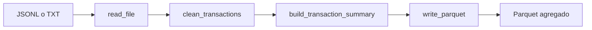

<div align="center">

# Wompi Transactions Data Pipeline

Pipeline reproducible para convertir transacciones en una vista analítica de operaciones aprobadas.

**50.000 transacciones · 42.427 aprobadas · 21.529 filas agregadas**


[Pipeline](#pipeline) · [Arquitectura](#arquitectura) · [Instalación](#instalación) · [Ejecución](#ejecución) · [Notebook](#notebook) · [Salida](#esquema-de-salida)

</div>

## Qué resuelve

El proyecto lee transacciones en formato JSON Lines, normaliza los campos necesarios y genera un archivo Parquet agregado por fecha y BIN. Solo las operaciones con estado `APPROVED` participan en el resultado.

| Entrada | Procesamiento | Salida |
| --- | --- | --- |
| JSONL o TXT con contenido JSON Lines | Lectura, limpieza, filtrado y agregación | Parquet ordenado por fecha y BIN |

## Pipeline



1. Lee el archivo de entrada y construye un DataFrame.
2. Selecciona las columnas requeridas y normaliza fecha, estado y monto.
3. Extrae el BIN desde `payment_method_type.extra.bin`.
4. Filtra las transacciones aprobadas.
5. Calcula la cantidad y el monto aprobado por fecha y BIN.
6. Ordena el resultado y lo escribe en formato Parquet.

## Arquitectura

`main.py` orquesta el flujo y mantiene la lectura, la escritura y el registro de eventos en los límites del pipeline. Las transformaciones se concentran en funciones que reciben y retornan DataFrames, mientras que `python/metadata/` centraliza columnas, estados y claves de agrupación.

```text
.
├── main.py
├── notebooks/
│   └── transactions_exploration.ipynb
├── python/
│   ├── metadata/
│   │   └── transaction_metadata.py
│   └── utils/
│       ├── data_cleaning.py
│       ├── data_transformation.py
│       ├── file_reader.py
│       └── file_writer.py
├── output/
│   └── transactions_summary.parquet
├── .gitignore
├── README.md
└── requirements.txt
```

## Instalación

Requisitos: Python 3.12 y `pip`.

```powershell
py -3.12 -m venv .venv
.\.venv\Scripts\Activate.ps1
python -m pip install -r requirements.txt
```

Las dependencias principales son `pandas`, para procesar los datos, y `pyarrow`, como motor de escritura y lectura de Parquet.

## Preparación de los datos

El archivo se recibe descomprimido y debe ubicarse en:

```text
data/transactions_50k.jsonl
```

La carpeta `data/` está excluida del control de versiones porque contiene información personal, operacional y documentos locales del reto.

## Ejecución

Desde la raíz del proyecto:

```powershell
python main.py
```

| Parámetro | Valor predeterminado |
| --- | --- |
| `--input-path` | `data/transactions_50k.jsonl` |
| `--output-path` | `output/transactions_summary.parquet` |

También se pueden indicar rutas diferentes sin modificar el código:

```powershell
python main.py --input-path data/transactions_50k.jsonl --output-path output/transactions_summary.parquet
```

El logger informa el inicio del proceso, las filas leídas, las transacciones aprobadas, las filas agregadas y la ruta del resultado.

## Notebook

El notebook [`notebooks/transactions_exploration.ipynb`](notebooks/transactions_exploration.ipynb) reproduce el pipeline en el mismo orden que `main.py`. Presenta la entrada, las decisiones de limpieza, las transformaciones y el resultado sin implementar una lógica paralela.

## Esquema de salida

| Columna | Descripción |
| --- | --- |
| `transaction_date` | Fecha de creación de la transacción. |
| `month` | Mes de la transacción. |
| `year` | Año de la transacción. |
| `bin` | Bank Identification Number asociado al método de pago. |
| `approved_transaction_count` | Cantidad de transacciones aprobadas. |
| `approved_amount_in_cents` | Suma de los montos aprobados en centavos. |

## Decisiones y supuestos

- `created_at` define la fecha de la transacción.
- El estado se normaliza eliminando espacios y convirtiéndolo a mayúsculas.
- Solo el valor exacto `APPROVED` representa una aprobación después de normalizarlo.
- El BIN se obtiene de `payment_method_type.extra.bin`.
- Los montos se convierten a enteros y se conservan en centavos porque la fuente no informa una moneda.
- Las columnas de entrada requeridas deben existir; si falta alguna, el pipeline se detiene.
- El resultado se ordena por fecha, mes, año y BIN para mantener una salida determinista.

## Resultado validado

| Métrica | Resultado |
| --- | ---: |
| Transacciones leídas | 50.000 |
| Transacciones aprobadas | 42.427 |
| Filas agregadas | 21.529 |
| Monto aprobado en centavos | 1.965.579.524.955 |
| Valores nulos en la salida | 0 |
| Claves agregadas duplicadas | 0 |

Con la misma entrada, dos ejecuciones consecutivas generan el mismo esquema, orden, contenido y SHA-256.

## Desactivación del entorno

```powershell
deactivate
```
